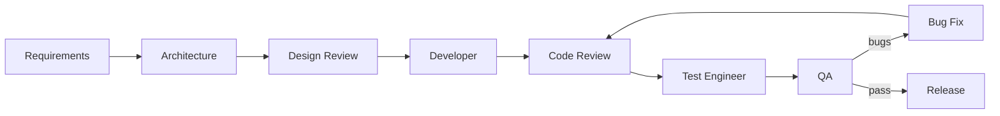

# TurnOverCheck — Agent Orchestration Guide

This project uses **specialized Cursor Agent Skills** for each phase of the software lifecycle. Skills live in `.cursor/skills/`.

## Project context

- **Product:** Shop & wholesaler turnover, inventory, billing, and reporting app
- **Roles:** Admin, Shop Owner, Wholesaler
- **Requirements:** [docs/REQUIREMENTS.md](../docs/REQUIREMENTS.md)
- **User stories:** [docs/USER-STORIES.md](../docs/USER-STORIES.md)
- **Architecture (draft):** [docs/ARCHITECTURE.md](../docs/ARCHITECTURE.md)

## Recommended development workflow



## Agent roles & skills

| Phase | Skill name | When to invoke |
|-------|------------|----------------|
| Architecture | `turnover-architect` | System design, DB schema, API design, tech stack |
| UI/UX design | `turnover-design-review` | Wireframes, UI components, UX flows |
| Implementation | `turnover-developer` | Feature coding, APIs, frontend |
| Code review | `turnover-code-review` | PR review, quality & security check |
| Test planning | `turnover-test-engineer` | Test cases, automation, coverage |
| QA validation | `turnover-qa` | Acceptance testing against requirements |
| Bug resolution | `turnover-bug-fix` | Triage, root cause, fix, regression |

## How to use skills

In Cursor chat, reference the skill or describe the task — the agent loads the matching skill from `.cursor/skills/<name>/SKILL.md`.

Examples:

- *"Use turnover-architect to design the purchase/billing module"*
- *"Run turnover-code-review on my latest changes"*
- *"Use turnover-qa to validate shop dashboard against S-04"*

## Quality gates

Before merging any feature:

1. **Code review** — `turnover-code-review` (no critical issues)
2. **Tests** — `turnover-test-engineer` (unit + integration for changed areas)
3. **QA sign-off** — `turnover-qa` (user story acceptance criteria met)

## Bug lifecycle

1. **Report** — QA or test engineer files issue with steps, expected vs actual
2. **Triage** — `turnover-bug-fix` assigns severity (P0–P3)
3. **Fix** — Developer or bug-fix skill implements minimal fix
4. **Verify** — QA re-tests; regression test added if applicable

## Tech stack (confirmed)

| Layer | Choice |
|-------|--------|
| Frontend | React + TypeScript + Vite |
| UI | Tailwind CSS + shadcn/ui |
| Backend | Node.js + Express or NestJS |
| Database | PostgreSQL (shared schema, shop_id tenant isolation) |
| Auth | JWT + RBAC (admin, shop, wholesaler) |
| Reports | PDF (pdfkit) + Excel (exceljs) |
| GST | PDF invoice template; direct amount entry (no GST portal v1) |

**Tenancy:** Multi-business SaaS — kirana + general retail shops on one platform.

## Project rules

Always-on conventions: `.cursor/rules/turnover-project.mdc`

## Phase checklist (MVP)

```
Phase 0 — Setup
- [ ] Repo scaffold (architect + developer)
- [ ] Auth + RBAC
- [ ] Admin: create shop/wholesaler

Phase 1 — Shop core
- [ ] Daily purchase rows (source name + amount)
- [ ] Nightly galla entry
- [ ] Dashboard + shop-wise reports

Phase 2 — GST & polish
- [ ] GST invoice PDF + auto invoice number
- [ ] Monthly report export

Phase 3 — Optional
- [ ] Wholesaler portal
- [ ] Item-level inventory (Phase 2 in requirements)

Phase 4 — Hardening
- [ ] Full QA pass
- [ ] Code review + security review
- [ ] Bug burn-down
```
