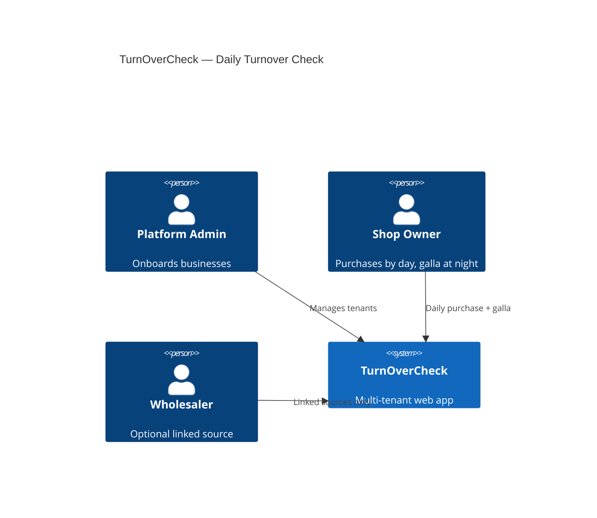

# TurnOverCheck — Architecture (Draft)

> Multi-business SaaS. Core: daily purchase rows (source shop + amount) + nightly galla total.

## System context



## Core daily model

| Entity | Cardinality | Purpose |
|--------|-------------|---------|
| `DailyPurchase` | **Many per day** | `source_name` + `amount` (₹ paise) |
| `DailyGalla` | **One per day per shop** | Total sales from galla (evening) |
| `GstInvoice` | Optional | Formal GST PDF; auto `invoice_no` |

**Daily profit** = `DailyGalla.amount` − SUM(`DailyPurchase.amount`) for same `date`.

## Multi-tenant model

| Concept | Description |
|---------|-------------|
| **Shop (tenant)** | One business, one login; all data scoped by `shop_id` |
| **Isolation** | Every query filters `shop_id` from JWT |
| **No multi-branch** | One owner = one shop (v1) |

## Module boundaries

| Module | Responsibility |
|--------|----------------|
| `auth` | Login, JWT, RBAC |
| `admin` | Shop/wholesaler CRUD, linking |
| `daily-purchases` | CRUD purchase rows (source name + amount) |
| `daily-galla` | Upsert one galla per date |
| `dashboard` | Today totals, profit, purchase breakdown |
| `purchases-page` | Filtered totals, by-store summary, detail list, export |
| `source-reports` | API aggregation for Purchases page tabs |
| `monthly-reports` | Day-wise + source-wise export |
| `invoicing` | GST PDF + `InvoiceSequence` auto-number |
| `wholesaler-portal` | Optional: linked shop purchase totals |

## Core entities (v1)

```
User (id, email, password_hash, role, shop_id?, wholesaler_id?, status)
Shop (id, name, address, gstin, state_code, invoice_prefix, owner_user_id)

PurchaseSource (id, shop_id, name)          -- saved names for autocomplete; optional
DailyPurchase (id, shop_id, date, source_name, amount_paise, note?, created_at)
DailyGalla (id, shop_id, date, amount_paise, note?, created_at)
  UNIQUE(shop_id, date)

InvoiceSequence (shop_id, fiscal_year, last_number)
GstInvoice (id, shop_id, invoice_no, date, lines_json, taxable_total, cgst, sgst, igst, grand_total, pdf_url?)

Wholesaler (id, name, ...)                  -- optional admin-managed
ShopWholesalerLink (shop_id, wholesaler_id) -- optional; source_name may match wholesaler name
```

### Amount storage

- All money in **integer paise** (₹100.50 → 10050)
- User enters rupees in UI; API converts

## API endpoints (v1 core)

| Method | Path | Description |
|--------|------|-------------|
| POST | `/shops/:id/purchases` | Add purchase row (source_name, amount) |
| GET | `/shops/:id/purchases` | List rows; query: `from`, `to`, `source`, `search`, `sort`, `page` |
| GET | `/shops/:id/purchases/summary` | Totals + grouped by store for filters |
| GET | `/shops/:id/purchases/sources` | Distinct source names (for filter dropdown) |
| PUT/DELETE | `/shops/:id/purchases/:pid` | Edit/delete row |
| PUT | `/shops/:id/galla` | Set/update galla for date (one per day) |
| GET | `/shops/:id/dashboard?date=` | Purchases sum, galla, profit, breakdown |
| GET | `/shops/:id/reports/by-source?from=&to=` | Legacy alias → use `/purchases/summary` |
| GET | `/shops/:id/reports/monthly?month=` | Day-wise galla vs purchases |
| POST | `/shops/:id/invoices` | Create GST invoice → auto invoice_no + PDF |

## Dashboard response shape

```json
{
  "date": "2026-06-29",
  "totalPurchases": 1260000,
  "galla": 1580000,
  "profit": 320000,
  "purchaseRows": [
    { "id": "...", "sourceName": "Metro Wholesale", "amount": 650000 },
    { "id": "...", "sourceName": "Reliance Fresh", "amount": 400000 }
  ],
  "gallaEntered": true
}
```

## GST invoice (separate from galla)

- Shop creates invoice when formal bill needed (not every galla day)
- Auto `invoice_no` from `InvoiceSequence` (e.g. `INV-2026-0042`)
- No mandatory buyer GSTIN
- Direct amount entry on lines

## Phase 2 entities (deferred)

```
Product, StockMovement, SaleLine, PurchaseLine — item-level inventory
```

## Security

- JWT: `role`, `shopId`
- `shopId` in URL must match token
- `DailyGalla`: upsert enforces UNIQUE(shop_id, date)

## Deployment

- PostgreSQL, shared schema, `shop_id` on all tenant tables
- See [REQUIREMENTS.md](REQUIREMENTS.md)
